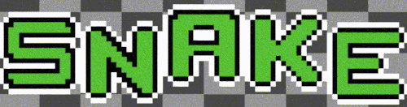

---

This is my first project using [SFML](https://www.sfml-dev.org/). As such, I made it to test some of SFML's features such as gamepad support and fonts. Try connecting a controller to your computer to try out the game with a controller.

## Building

Recursively clone the repository in order to fetch SFML (it is added to the project as a git submodule)

```bash
git clone https://github.com/piigle/sfml-snake.git --recursive
```

Build using CMake (generator of your choice)

```bash
mkdir build
cd build
cmake -G "Visual Studio 17 2022" ..
cmake --build .
```

Make sure that the executable is run from the root of the project so that the assets can be accessed.
NOTE: You will need to have openal32.dll alongside your executable for it to run. 
